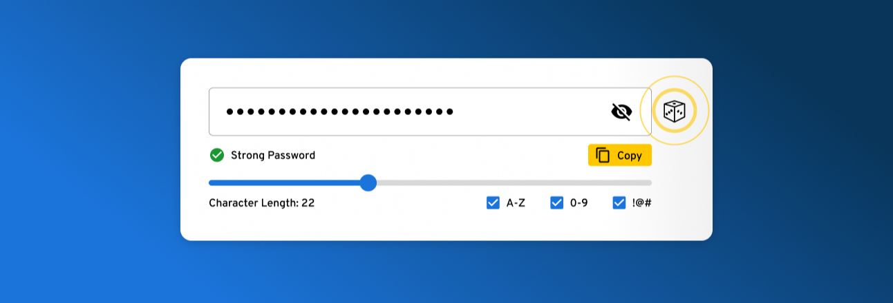

# Password Generator



A flexible and secure password generator implemented in Python that supports multiple password generation strategies.

## Table of Contents
- [Features](#features)
- [Requirements](#requirements)
- [Installation](#installation)
- [Usage](#usage)
  - [Random Password](#random-password)
  - [Memorable Password](#memorable-password)
  - [PIN Generator](#pin-generator)
- [Examples](#examples)
- [Contributing](#contributing)
- [License](#license)

## Features
- 🔐 Multiple password generation strategies:
  - Random passwords with customizable character sets
  - Memorable passwords using dictionary words
  - Numeric PIN codes
- 🛠️ Configurable options for each generator type
- 📖 Uses EFF's large wordlist for memorable passwords
- 🎯 Clean, object-oriented design with abstract base class
- 💻 Interactive command-line interface

## Requirements

```
python >= 3.8
```

## Installation

1. Clone the repository:
```bash
git clone https://github.com/your-username/Password-Generator.git
cd Password-Generator
```

2. Create and activate a virtual environment (optional but recommended):
```bash
python -m venv venv
source venv/bin/activate  # On Windows: venv\Scripts\activate
```

## Usage

Run the program using Python:
```bash
python src/main.py
```

### Random Password
- Customizable length (default: 16)
- Optional uppercase letters
- Optional numbers
- Optional special symbols

### Memorable Password
- Configurable number of words (default: 4)
- Custom word separator
- Optional capitalization
- Based on EFF's large wordlist

### PIN Generator
- Customizable length (default: 16)
- Generates numeric-only PINs

## Examples

```bash
# Random Password Generation
$ python src/main.py
Enter password type (random, memorable, pin) or 'q' to quit: random
Enter password length (default 16): 12
Include uppercase letters? (y/n): y
Include numbers? (y/n): y
Include symbols? (y/n): y
Kj#9mP$2nL&4

# Memorable Password Generation
$ python src/main.py
Enter password type (random, memorable, pin) or 'q' to quit: memorable
Enter number of words (default 4): 4
Capitalize words? (y/n): y
CORRECT-HORSE-BATTERY-STAPLE

# PIN Generation
$ python src/main.py
Enter password type (random, memorable, pin) or 'q' to quit: pin
Enter PIN length (default 6): 6
847591

# Exit the program
Enter password type (random, memorable, pin) or 'q' to quit: q
```

## Contributing
1. Fork the repository
2. Create your feature branch (`git checkout -b feature/amazing-feature`)
3. Commit your changes (`git commit -m 'Add some amazing feature'`)
4. Push to the branch (`git push origin feature/amazing-feature`)
5. Open a Pull Request

## License

This project is licensed under the MIT License - see the [LICENSE](LICENSE) file for details.

Copyright (c) 2025 Mohammadreza Naseri